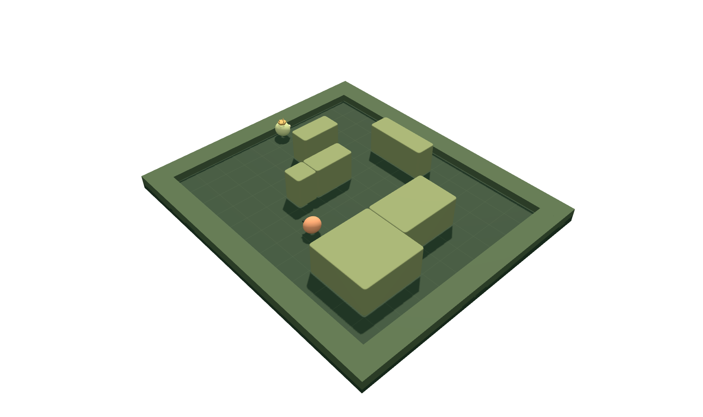

# Hide and Seek

Two pretrained neural policies play a live 3D game in your browser. A crowned hider gets a head start; a seeker searches using limited, occluded sight. Generate a new seeded arena, add/move/remove cover, inspect sight, or replay the same layout with the networks before training.



## Run

Node.js 22 or newer:

```sh
npm install
npm run dev
npm test
npm run test:browser
npm run build
npm run capture
```

Vite serves the standalone tool on `http://127.0.0.1:5181`. Browser checks use Playwright's installed Chromium (`npx playwright install chromium` if necessary). WebGL is required. The only runtime dependency is Three.js, loaded with the renderer. No server, API key, account, or online training is involved.

## Rules and controls

- The hider moves for 24 preparation steps while the seeker stays blind and still. Neither agent receives preparation rewards.
- Both then act for up to 180 play steps. The seeker wins by coming within 0.65 cells with an unobstructed line of sight. Otherwise the hider wins.
- Actions are wait/up/right/down/left; speeds are 0.30 cells per step for the hider and 0.34 for the seeker. Movement stays on the ground plane. Cover cannot be pushed or grabbed.
- Agents have omnidirectional sight with a seven-cell range. Exact axis-aligned box intersections handle occlusion, including corner grazes. Eight sampled local wall rays reach 4.2 cells. An opponent's last observed location expires after 60 steps.
- The spectator camera sees the whole arena. It never supplies camera information to either policy. The sight inspection outline and eight rays explain that distinction.
- Play/Pause, Step, Reset and speed change playback. Drag or the two rotation buttons orbit the view; scroll/pinch zoom. Hidden and offscreen arenas suspend playback.
- Generate bounded 10–20 × 10–20 arenas with 0–12 blocks. Edit cover through the 3D picker or numeric controls and a keyboard-accessible block list. Blocks are 1–3 cells on each side. Validation rejects overlaps, blocked starts, and disconnected walkable floor. Editing resets the round and retains the same frozen policies.
- Export/import arena or policy JSON. The seed reproduces arena geometry and browser action sampling. Imported policies are marked unverified; published scores are hidden for them. Export scene PNG captures the actual WebGL scene with transparency, without interface framing.

## What was learned

Each agent is an independent `23 → 48 → 48 → 5` tanh MLP with 3,749 actor parameters. It samples one of five actions from its logits. The actor receives only its wall rays, visible opponent offset, a visible mask, stale remembered offset and age, its own velocity/position, arena dimensions, and phase/time. Hidden opponent coordinates are zeroed. The seeker never acquires opponent memory during preparation. The critic has the same restricted inputs.

The policies were trained using PPO-Clip, not pathfinding or action imitation. The actor never receives a grid, map ID, expert path, or hidden opponent position. Connectivity flood fill is used only by arena generation/editor validation. Small signed visible-distance progress, first-sighting, bounded cell novelty and hidden/seen rewards help learning; tag/timeout rewards of ±2 dominate. The exact reward formulas are in `training/sim.py` and mirrored in `src/core/arena.js`.

Training uses 48 simultaneous arenas, 128-step rollouts, Adam at 0.0003, discount 0.99, GAE λ 0.95, PPO clip 0.2, up to four epochs of 512-sample minibatches, and KL early stopping. A curriculum starts the seeker against stationary/wandering targets on smaller arenas, then trains the hider against an observation-only pursuer. Later updates alternate roles against frozen snapshots and fixed baselines. This is small-scale self-play with static cover, **not a reproduction of emergent tool use**.

The frozen release used 14,745,600 simulated arena steps, 138,563 completed episodes, and 2,400 PPO updates (training seed 2709). It recorded 121,647 distinct training geometry hashes. Offline training took 468.46 seconds on an Apple M3 Pro CPU with PyTorch restricted to one thread. Later training arenas span widths 10–18, heights 10–16, and 2–9 requested blocks; larger/editor configurations are supported but not guaranteed to perform similarly.

The implementation follows the [PPO-Clip formulation in OpenAI Spinning Up](https://spinningup.openai.com/en/latest/algorithms/ppo.html). The much larger [OpenAI hide-and-seek research](https://openai.com/index/emergent-tool-use/) is inspiration for the setting, not a capability claim for this experiment.

## Untouched evaluation

The final checkpoint was selected using a separate 100-arena validation set. It was then tested once on **200 new geometry seeds × three independent spawn arrangements**, 600 rounds per matchup. Test geometry hashes were checked against all recorded training hashes. Neither weights nor settings were changed based on these results.

| Matchup | Before learning | Pretrained |
| --- | ---: | ---: |
| Seeker capture rate vs reactive flee | 2.17% | 97.50% |
| Hider survival vs reactive chase/search | 6.00% | 77.33% |

The fixed baselines consume the same restricted observations. Reactive chase/search follows visible or last-seen offsets with local wall avoidance; reactive flee moves away when it sees the seeker and otherwise uses a persistent random walk. These are simple baselines, not optimal planners.

Against a persistent walker, the pretrained seeker captures 99.17% and the hider survives 99.50%. Against **each other**, the pretrained seeker wins 72.17%, and the hider wins 27.83%; that self-play split alone is not evidence of improvement. In that matchup, the mean play length is 127.44 steps; mean collisions are 22.8 for the hider and 6.73 for the seeker. Agents can still bump into walls, revisit places, or lose track of an opponent.

Paired bootstrap intervals resample entire maps, retaining their three starts: hider improvement +71.33 percentage points (95% interval 66.67–75.83); seeker +95.33 points (93.50–97.00). `evaluation.json` contains the aggregate protocol, scores, visibility/collision/distance measures, hashes and intervals. `training/test-episodes.json` retains every scored round. Hidden fractions count the remainder of a captured round as zero hidden time. These measurements apply to the shipped policies and generator distribution, not arbitrary edited worlds.

## Reproduce training

Python 3.12 was used. Create a dedicated environment and install the pinned dependencies:

```sh
python3 -m venv .venv
.venv/bin/pip install -r training/requirements.txt
PYTHON_BIN=.venv/bin/python npm run train
.venv/bin/python training/report.py training/runs/final/checkpoint-2400.pt
.venv/bin/python training/export.py training/runs/final/checkpoint-2400.pt
.venv/bin/python training/parity.py
.venv/bin/python training/test_sim.py
npm test
```

Training outputs are intentionally ignored under `training/runs/`. The portable actor weights are shipped in `public/models/hide-seek.json`; optimizer and critic state are unnecessary for inference. CPU/PyTorch changes can affect exact training reproducibility. The exporter rounds weights to seven decimal places; cross-language tests compare resulting logits within 0.0002 and validate trajectories, observations, rewards, generator output, collisions, preparation privacy and hidden-position invariance.

## Embed

```js
import { mountExperiment, metadata } from '@zachshotamartin/hide-and-seek';
import '@zachshotamartin/hide-and-seek/style.css';

const instance = mountExperiment(container, {
  embedded: true,
  assetBase: '/experiments/hide-and-seek/'
});
// On unmount:
instance.dispose();
```

Copy `public/models/hide-seek.json` to `${assetBase}/models/hide-seek.json`. The default asset location is relative to the standalone document. Mount returns synchronously; model/renderer loading is internal. Embedded mode omits the standalone heading and makes the live scene background transparent so the containing page shows through. All styles are scoped under `.hide-seek`. Disposal cancels animation, aborts loading, removes observers/listeners, and releases WebGL resources. Delayed file reads are invalidated by later edits/reset/imports and disposal.

All showcase PNGs are real transparent WebGL exports made by `npm run capture`. No generated images or composited interface mockups are used.
